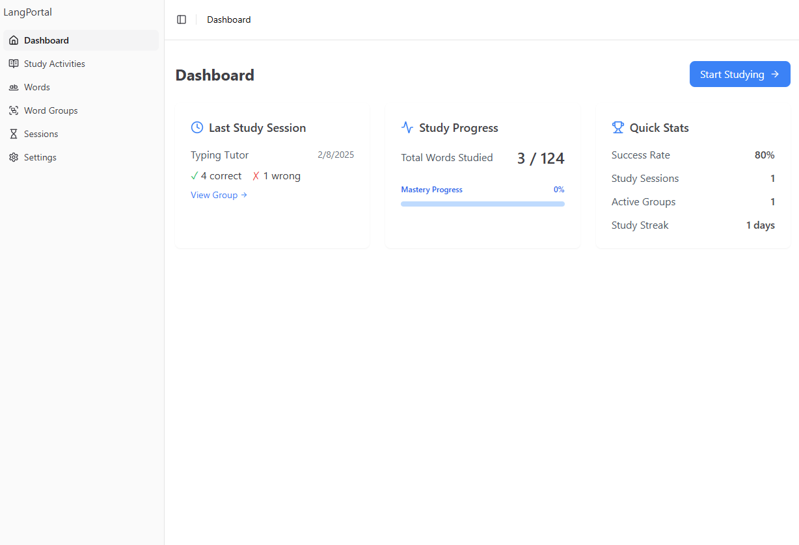

# Language Learning Portal

A full-stack web application for language learning, featuring interactive study sessions, word management, and progress tracking.



## Overview

The Language Learning Portal is a comprehensive platform designed to help users learn languages through:
- Interactive study sessions
- Word group organization
- Progress tracking
- Performance analytics
- Customizable learning activities

## Project Structure

```
lang-portal/
├── frontend/           # React TypeScript frontend
├── backend/            # FastAPI Python backend
├── reference_images/   # UI/UX reference images
└── spec/              # Project specifications
```

## Quick Start

### Prerequisites

- Node.js v16+ for frontend
- Python 3.9+ for backend
- npm or yarn
- pip
- virtualenv (recommended)

### Backend Setup

```bash
# Navigate to backend directory
cd backend

# Create and activate virtual environment
python -m venv venv
source venv/bin/activate  # On Windows: venv\Scripts\activate

# Install dependencies
pip install -r requirements.txt

# Create environment file
cp .env.example .env

# Start the server
uvicorn app.main:app --reload
```

The API will be available at `http://localhost:8000`
API documentation: `http://localhost:8000/docs`

### Frontend Setup

```bash
# Navigate to frontend directory
cd frontend

# Install dependencies
npm install
# or
yarn install

# Create environment file
cp .env.example .env

# Start development server
npm run dev
# or
yarn dev
```

The application will be available at `http://localhost:5173`

## Features

### Study Activities
- Create and manage study activities
- Track progress and performance
- Interactive learning sessions
- Customizable activity settings

### Word Management
- Create and organize word groups
- Add/edit words with translations
- Track word learning progress
- Search and filter capabilities

### Study Sessions
- Interactive study sessions
- Real-time progress tracking
- Performance statistics
- Session history

### Analytics
- Learning progress visualization
- Performance metrics
- Study streak tracking
- Activity completion rates

## Tech Stack

### Frontend
- React 18
- TypeScript
- Material-UI (MUI)
- React Query
- React Router
- Axios

### Backend
- FastAPI
- SQLAlchemy
- Pydantic
- SQLite
- Uvicorn

## Development

### Running Tests

Backend:
```bash
cd backend
pytest
```

Frontend:
```bash
cd frontend
npm run test
```

### Code Style

Backend:
- Black for Python formatting
- Flake8 for linting

Frontend:
- ESLint for linting
- Prettier for formatting

## API Documentation

Full API documentation is available at `http://localhost:8000/docs` when running the backend server.

Key endpoints:
- `/api/study-activities` - Study activities management
- `/api/groups` - Word groups management
- `/api/words` - Words management
- `/api/study-sessions` - Study sessions management

## Contributing

1. Fork the repository
2. Create your feature branch (`git checkout -b feature/amazing-feature`)
3. Commit your changes (`git commit -m 'Add some amazing feature'`)
4. Push to the branch (`git push origin feature/amazing-feature`)
5. Open a Pull Request

## License

This project is licensed under the MIT License - see the [LICENSE](LICENSE) file for details.

## Acknowledgments

- Material-UI for the component library
- FastAPI for the efficient backend framework
- SQLAlchemy for the robust ORM
- React Query for efficient data fetching 