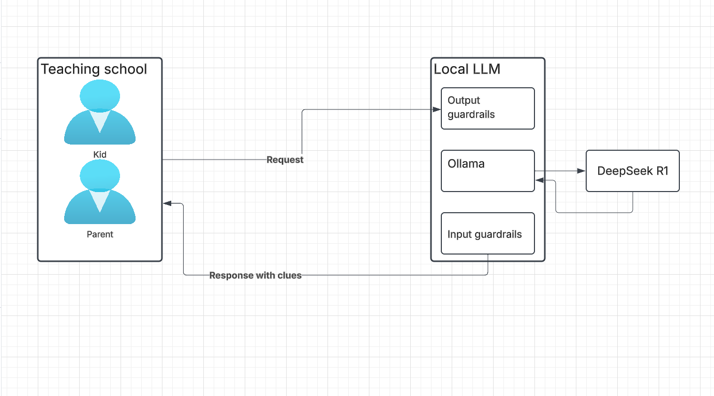

## Functional Requirements

The solution aims to provide local AI assistance for homeschooler parents and their kids in Montreal to achieve French language proficiency at B2 level. This level enables users to understand complex texts, interact with reasonable fluency, and produce clear, detailed text on various subjects.

## System Architecture

### Architecture Components

1. **Teaching School Environment**
   - Kid: The primary learner working on French B2 level
   - Parent: The supervisor/facilitator of the learning process

2. **Local LLM System**
   - Input Guardrails: Ensures appropriate content and prevents sensitive data leakage
   - Ollama: Local model server managing the LLM
   - Output Guardrails: Ensures responses are educational and provide clues without direct answers

3. **DeepSeek R1**
   - Primary language model for French learning assistance
   - Runs completely locally through Ollama

### Data Flow
1. Student/Parent sends a French learning request
2. Input guardrails filter and validate the request
3. Ollama processes the request using DeepSeek R1
4. Output guardrails ensure responses provide helpful clues without direct answers
5. System returns educational guidance back to the user

## Requirements, Risks, Assumptions, & Constraints

### Requirements
- Each parent should be able to run the entire stack on their personal computer
- The system must work offline to protect children's privacy
- Must be user-friendly for non-technical parents
- Must support French language learning activities at B2 level including:
  - Reading comprehension
  - Writing practice
  - Grammar exercises
  - Vocabulary building
  - Conversation practice

### Risks
- Hardware requirements might be too high for some parents' computers
- Parents might need technical support for setup
- Quality of French language responses might vary based on hardware capabilities
- Model might not always provide perfect French grammar or pronunciation guidance

### Assumptions
- Parents have computers capable of running large language models
- Users have basic technical knowledge for initial setup
- DeepSeek model has sufficient French language capabilities for B2 level instruction
- Users have basic (A1-A2) French knowledge to build upon

### Constraints
- Must run locally on personal computers
- Limited by individual hardware capabilities
- Internet connection only needed for initial setup
- Focus solely on French B2 level content and exercises

## Infrastructure Design
- Using Ollama as the local model server
- DeepSeek r1 70B as the primary language model
- Local-first architecture to ensure privacy
- Minimal cloud dependencies
- Includes French language resources and exercises for B2 level

## Data Strategy
- All processing happens locally to protect privacy
- Local storage of French learning materials and exercises
- Implementation of French language assessment tools
- Regular progress tracking capabilities
- No sharing of student responses or personal information with external services

## Business Considerations

### Cost Considerations
- One-time hardware cost for computer upgrades (if needed)
- No ongoing API costs
- Optional cost for supplementary French learning materials
- Cost-effective compared to private French tutoring or language schools

### Lock-in Prevention
- Using open-source solutions to avoid vendor lock-in
- Local deployment ensures independence from cloud providers
- Easy export of learning progress and materials

### Use Case: French B2 Level Learning
- help local homeschoolers learn how to write in French with clues but no give a answer.

### Key Benefits
- Complete privacy and data control
- One-time setup cost
- Personalized French learning pace
- Consistent availability for practice
- Progress tracking for B2 level milestones
- Family-oriented learning environment