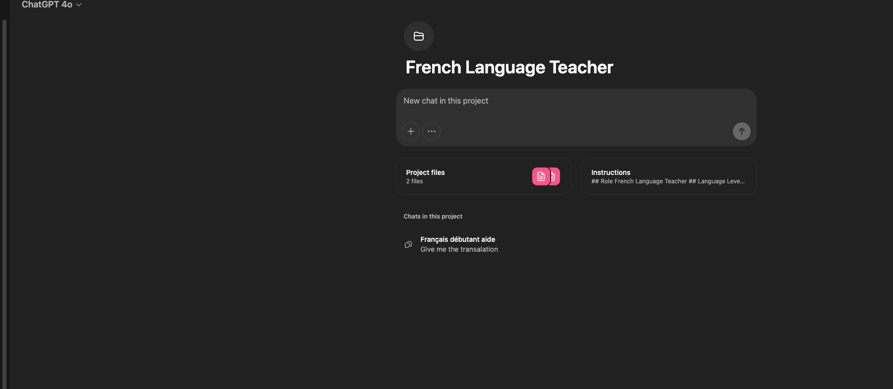

# ChatGPT Sentence Constructor Guide

## Overview
This guide explains how to use ChatGPT (paid version) for the sentence constructor project. The project helps students learn French through interactive sentence construction exercises.

## What I used
- Paid ChatGPT subscription (ChatGPT Plus)
- Text files (.txt) for all inputs
## Important File Format Notes
- All input files MUST be in `.txt` format
- XML-like structure should be contained within `.txt` files
- Do not use `.xml` files directly with ChatGPT

## Workspace Setup
Here's how your ChatGPT workspace should look:



Key elements in the workspace:
- Project title: "French Language Teacher"
- Files section with your .txt documents
- Instructions panel with role and language level
- New chat option for starting fresh conversations

## Project Structure
```
sentence-constructor/chatgpt/
├── french-teaching-test.txt      # Test cases and examples
├── sentence-structure-examples.txt    # Sentence structure patterns
└── prompt_to_teach.md           # Teaching instructions
```

## Key Features
1. Interactive sentence construction
2. Vocabulary assistance
3. Grammar guidance
4. Progressive learning states:
   - Setup
   - Attempt
   - Clues

## How to Use
1. Prepare your input files in `.txt` format
2. Follow the prompt engineering guidelines from [OpenAI's documentation](https://platform.openai.com/docs/guides/prompt-engineering)
3. Use the provided test cases and examples as templates
4. Ensure all XML-style content is saved in `.txt` files

## Best Practices
1. Keep file sizes reasonable for ChatGPT's context window
2. Use clear, structured formats in your .txt files
3. Follow the state transition rules defined in the teaching instructions
4. Reference the vocabulary and sentence structure examples provided

## File Format Examples
```
# Example content structure in .txt files:
<test-cases>
    <case id="simple-1">
        <english>I eat bread.</english>
        <vocabulary>
            <!-- vocabulary content -->
        </vocabulary>
    </case>
</test-cases>
```

## Support
For more information, visit the [OpenAI documentation](https://platform.openai.com/docs/guides/prompt-engineering)

## Version
1.0.0 - Initial Release