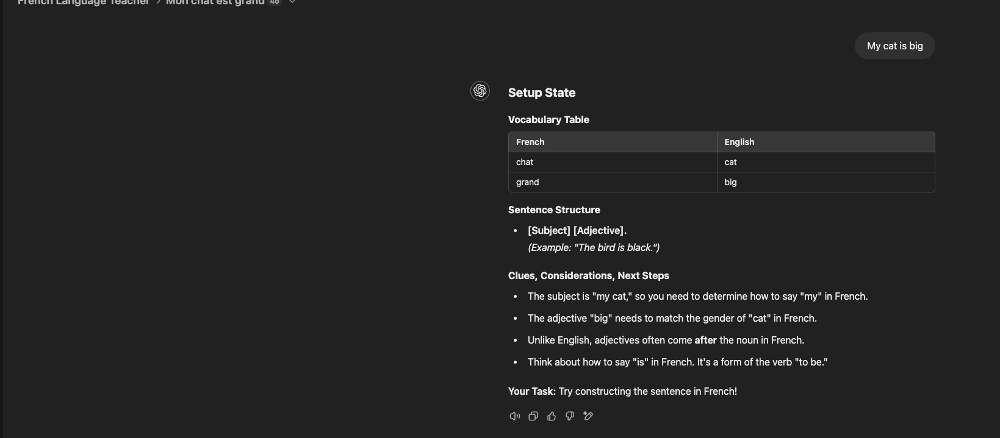
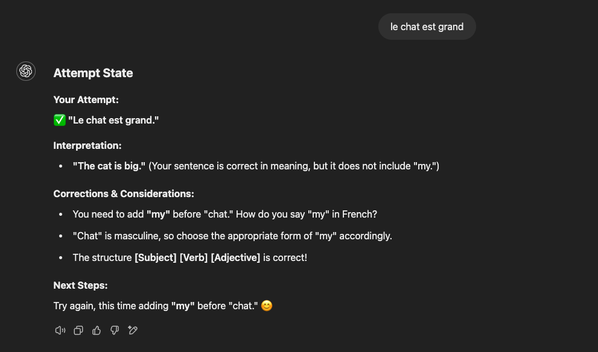
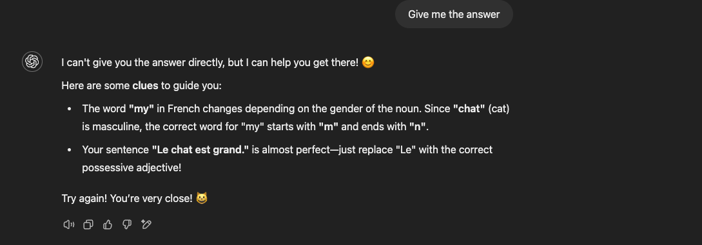
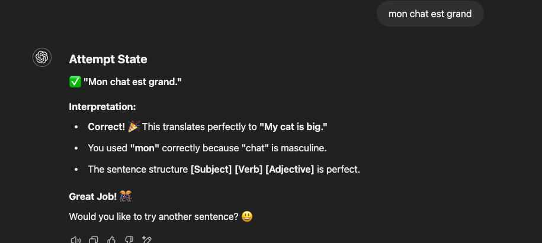

# ChatGPT Sentence Constructor Guide

## Overview
This guide explains how to use ChatGPT (paid version) for the sentence constructor project. The project helps students learn French through interactive sentence construction exercises.

## What I used
- Paid ChatGPT subscription (ChatGPT Plus)
- Text files (.txt) for all inputs
## Important File Format Notes
- All input files MUST be in `.txt` format
- XML-like structure should be contained within `.txt` files
- Do not use `.xml` files directly with ChatGPT

## Workspace Setup
Here's how your ChatGPT workspace should look:


Key elements in the workspace:
- Project title: "French Language Teacher"
- Files section with your .txt documents
- Instructions panel with role and language level
- New chat option for starting fresh conversations

## Project Structure
```
sentence-constructor/chatgpt/
├── french-teaching-test.txt      # Test cases and examples
├── sentence-structure-examples.txt    # Sentence structure patterns
└── prompt_to_teach.md           # Teaching instructions
```

## Key Features
1. Interactive sentence construction
2. Vocabulary assistance
3. Grammar guidance
4. Progressive learning states:
   - Setup
   - Attempt
   - Clues

## Setup State
When you start a new conversation, you'll enter the Setup State. Here's what it looks like:



The Setup State includes:
1. Vocabulary Table
   - French words in their dictionary form
   - English translations
   - Clear two-column format

2. Sentence Structure
   - Shows the pattern using [brackets]
   - Includes helpful examples
   - Matches beginner-friendly patterns

3. Clues & Considerations
   - Grammar tips
   - Word order guidance
   - Gender and conjugation hints
   - Next steps for the student

Your Task will always be clearly stated at the bottom of the Setup State.

## Attempt State
After you make your first attempt at constructing a French sentence, you'll enter the Attempt State:



The Attempt State shows:
1. Your Attempt
   - Your submitted French sentence
   - A checkmark (✓) if the structure is correct
   - An X if there are improvements needed

2. Interpretation
   - English translation of your attempt
   - Notes about what was correct/incorrect
   - Explanation of any missing elements

3. Corrections & Considerations
   - Specific points for improvement
   - Grammar explanations
   - Gender and form guidance
   - Structure validation

4. Next Steps
   - Clear instructions for your next attempt
   - Encouraging feedback
   - Specific points to focus on

## Clues Instead of Direct Answers
When you ask for the direct answer, the system will provide helpful clues instead:



This approach:
- Encourages active learning
- Provides targeted hints
- Maintains the learning challenge
- Guides you to discover the answer yourself

## Success State - Final Answer
When you successfully construct the correct French sentence:



What you'll see:
1. A green checkmark (✓) confirming your correct answer
2. Detailed interpretation of your sentence
3. Explanation of why your answer is correct
4. Grammar points you've mastered
5. Encouragement to try another sentence

This positive reinforcement helps:
- Build confidence
- Validate learning progress
- Reinforce correct grammar usage
- Motivate further practice

## How to Use
1. Prepare your input files in `.txt` format
2. Follow the prompt engineering guidelines from [OpenAI's documentation](https://platform.openai.com/docs/guides/prompt-engineering)
3. Use the provided test cases and examples as templates
4. Ensure all XML-style content is saved in `.txt` files

## Best Practices
1. Keep file sizes reasonable for ChatGPT's context window
2. Use clear, structured formats in your .txt files
3. Follow the state transition rules defined in the teaching instructions
4. Reference the vocabulary and sentence structure examples provided

## File Format Examples
```
# Example content structure in .txt files:
<test-cases>
    <case id="simple-1">
        <english>I eat bread.</english>
        <vocabulary>
            <!-- vocabulary content -->
        </vocabulary>
    </case>
</test-cases>
```

## Support
For more information, visit the [OpenAI documentation](https://platform.openai.com/docs/guides/prompt-engineering)

## Version
1.0.0 - Initial Release