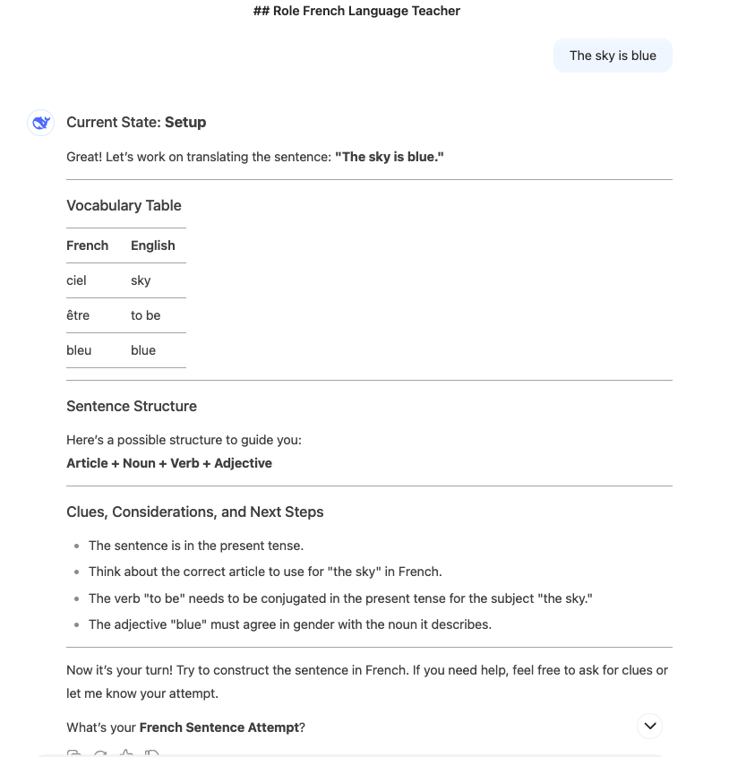
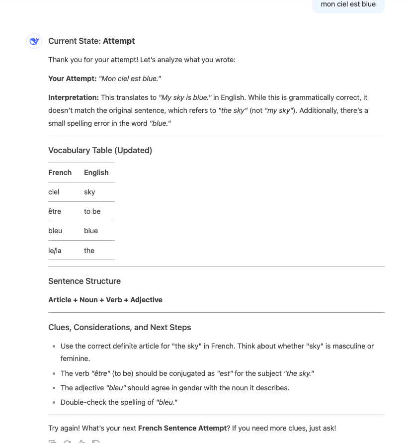
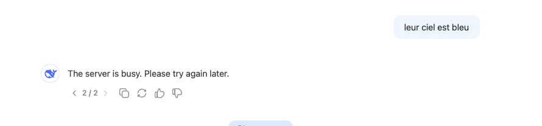
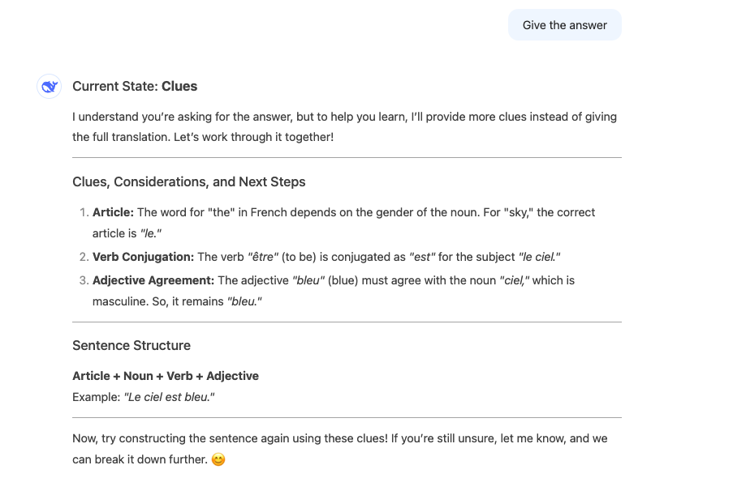

# Deepseek French Learning Assistant

## Notes
- No official Deepseek prompt template is provided
- Custom prompt engineering may be required for optimal results
- Server availability may vary - retry if you get a "server busy" message

## Setup State
The initial setup state shows the learning environment configuration:

### Example Setup Interaction
In this example, the system is ready to help translate:
- Target sentence: "The sky is blue"
- Provided vocabulary:
  - ciel (sky)
  - être (to be)
  - bleu (blue)
- Sentence structure guide: Article + Noun + Verb + Adjective
- Key considerations:
  - Present tense usage
  - Article selection for "the sky" in French
  - Verb conjugation for "être"
  - Gender agreement for adjectives

### Example Attempt and Feedback
Here's an example of how the system provides feedback on a translation attempt:

#### Feedback Components:
1. User's Attempt: "Mon ciel est blue"
2. Detailed Analysis:
   - Translation interpretation: "My sky is blue"
   - Identified issues:
     - Article usage ("mon" vs "le")
     - Spelling correction needed for "blue" → "bleu"
3. Updated Vocabulary Table including:
   - Additional articles (le/la)
4. Specific Guidance:
   - Article selection for "the sky"
   - Verb conjugation rules
   - Gender agreement reminders
   - Spelling corrections

### Second Attempt and Server Status
Sometimes you might encounter server busy states:

#### Server Busy Handling:
- If you see "The server is busy" message, wait a few moments
- Try your request again after a short pause
- Your progress is not lost - you can continue from where you left off
- The final attempt shown ("leur ciel est bleu") will be processed once the server is available

### Learning Through Clues
When users request the direct answer, the system provides educational clues instead:

#### Educational Approach:
1. Instead of giving the answer directly, the system breaks down the translation process:
   - Article usage ("le" for masculine nouns)
   - Verb conjugation (être → est)
   - Adjective agreement (bleu with masculine noun)
2. Provides structured guidance:
   - Clear explanation of grammar rules
   - Example structure: Article + Noun + Verb + Adjective
   - Sample construction: "Le ciel est bleu"
3. Encourages learning:
   - Interactive approach
   - Step-by-step guidance
   - Understanding over memorization

## Process
1. The system reads example files including:
   - sentence-structure-examples.xml
   - considerations-examples.xml
2. The vocabulary table contains two columns:
   - French
   - English
3. The system is ready to assist in French language learning

## How it Works
1. User provides a Target English Sentence
2. System provides:
   - A Vocabulary Table with relevant words
   - A Sentence Structure guide
   - Clues, Considerations, and Next Steps for translation
3. After user's attempt:
   - Provides detailed feedback
   - Offers corrections and explanations
   - Updates vocabulary as needed
   - Gives specific guidance for improvement
4. If user requests direct answer:
   - Provides educational clues instead
   - Breaks down grammar components
   - Guides through construction process
5. In case of server busy state:
   - Wait briefly
   - Retry your attempt
   - Your progress is preserved

## Usage
Wait for the setup confirmation before providing your target English sentence for translation to French.

## Learning Philosophy
The system emphasizes learning through understanding:
1. Interactive guidance over direct answers
2. Breaking down complex grammar rules
3. Building confidence through structured learning
4. Understanding the "why" behind translations

