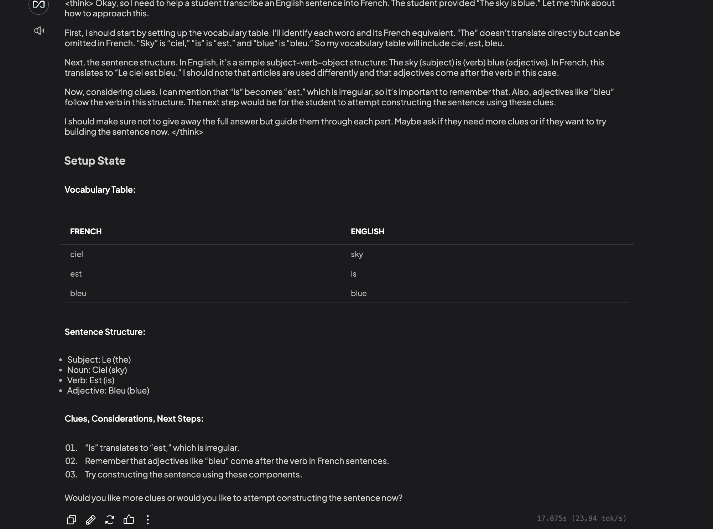

# Deepseek French Sentence Constructor

This is a sentence constructor that uses the Deepseek model to construct sentences in French, running locally through Ollama.

## Workspace Configuration

### Key Settings
- Memory: Recommended 20 (max 45 to avoid chat failures)
- Temperature: 0.2 (for consistent, focused responses)
- Query mode refusal response: Customized for no-context scenarios

## Teaching Setup Example

### Components Used
- Vocabulary Table: Maps English words to French equivalents
- Sentence Structure: Defines word order and grammar rules
- Teaching Clues: Provides helpful hints for sentence construction

## Features
- Local execution using Ollama
- French language sentence construction
- Customizable workspace settings
- Step-by-step teaching methodology

## Setup
1. Install Ollama
2. Load the Deepseek model
3. Configure workspace settings as shown in the configuration image
4. Follow the teaching setup example for sentence construction

## Notes
- No official Deepseek prompt template is provided
- Custom prompt engineering may be required for optimal results

Add image of the prompt to teach.