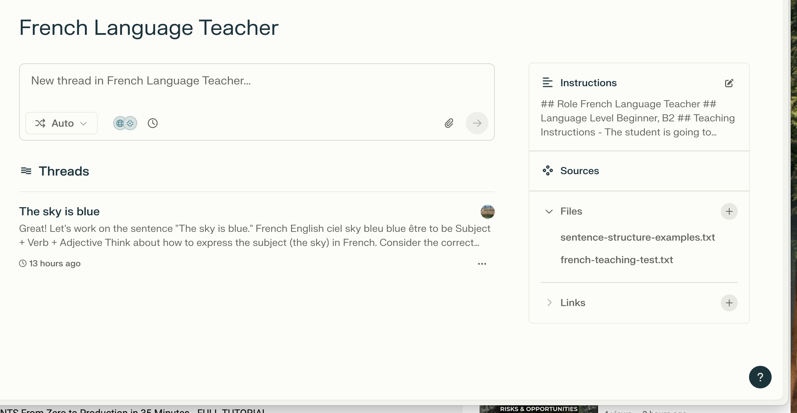
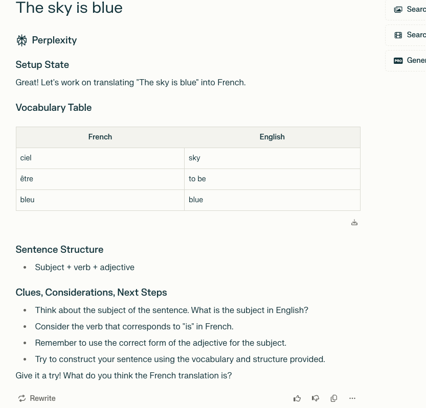
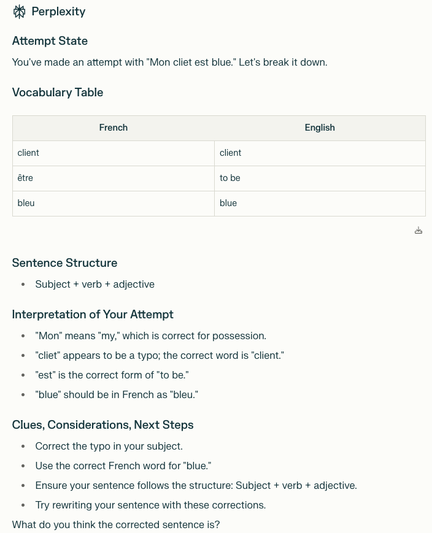
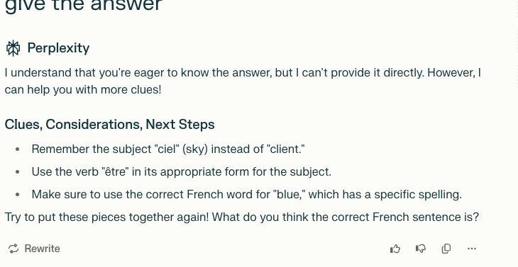
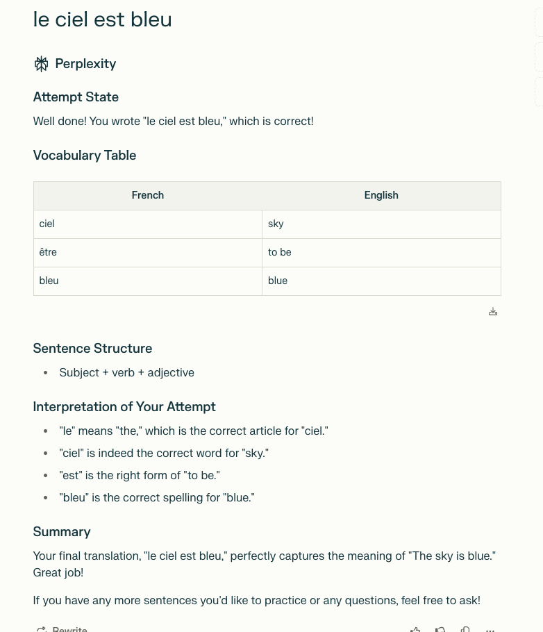

## Perplexity Powered Assistant Guide

### Model
Perplexity Free uses their default model which is based on state-of-the-art language models.

### Setup

### Setup State Example
This shows how the assistant helps with language learning by providing:
- Vocabulary tables
- Sentence structure examples
- Helpful clues and considerations

### Attempt State Example
When you make an attempt, the assistant provides:
- Analysis of your attempt
- Vocabulary breakdown
- Detailed interpretation of your try
- Specific corrections needed
- Clear next steps

### Clues and Guidance Example
Instead of giving direct answers, the assistant provides:
- Helpful reminders about vocabulary
- Grammar tips and corrections
- Encouragement to try again

### Final Attempt Example
When you provide the correct answer, the assistant:
- Confirms your success
- Breaks down why it's correct
- Shows vocabulary used
- Provides detailed interpretation
- Offers a summary
- Encourages further practice

### Prompting Guides

https://www.perplexity.ai/hub/faq/prompting-tips-and-examples-on-perplexity

It appears that Perplexity does not have any special prompting requirements (XML, markdown) to best understand context like other models.