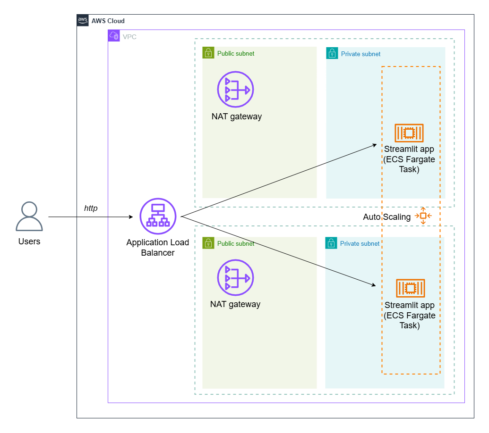
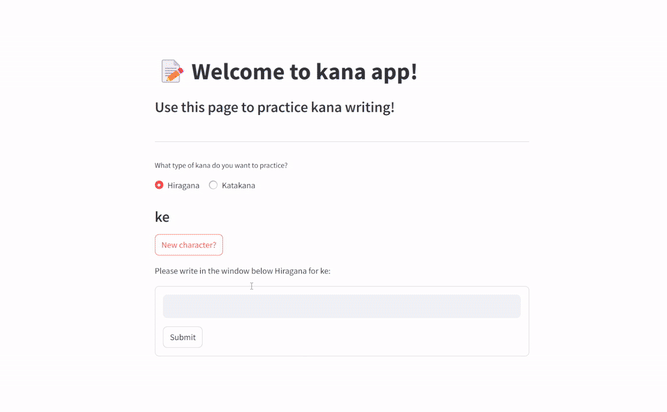
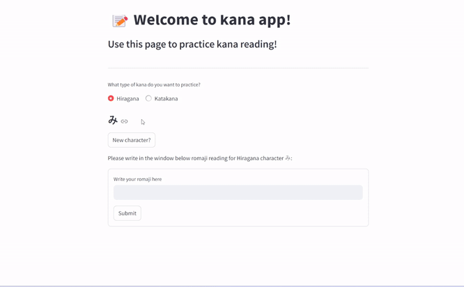
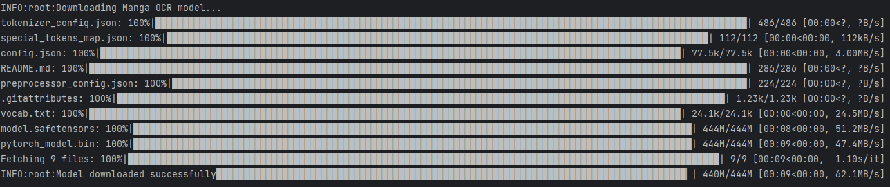
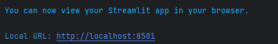
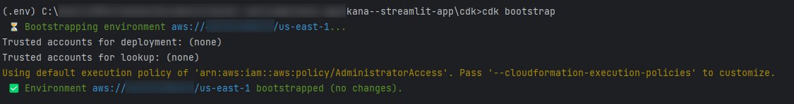
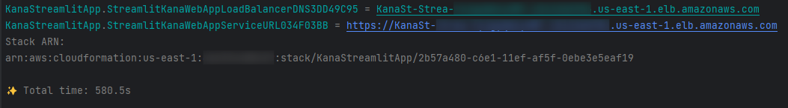
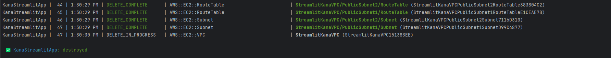

# Streamlit Kana app with AWS deployment

Learn Japanese kana (Katakana, Hiragana) with the help of a Streamlit app deployed on AWS!



## If you need deployment to HTTPS

If you want to increase solution security, please use the [`deploy-https`](https://github.com/dashapetr/kana--streamlit-app/tree/deploy-https) branch.

## What possibilities does Kana app include?

### 1- Learn kana characters:


### 2 - Given romaji (pronunciation), write kana:



### 3 - Given kana, transcribe it:



## What is Streamlit?

Streamlit is an open-source Python library that makes it easy to create and share custom web apps for machine learning and data science. By using Streamlit you can quickly build and deploy powerful data applications. For more information about the open-source library, see the [Streamlit documentation](https://docs.streamlit.io/).

## What is Japanese kana?

|  | 
|:---------------------------------------------------------------------------:| 
| *[Image source](https://www.mlcjapanese.co.jp/hiragana_katakana.html)*      |

The modern Japanese writing system uses a combination of logographic kanji, which are adopted Chinese characters, and syllabic kana. 
Kana itself consists of a pair of syllabaries: **hiragana**, used primarily for native or naturalized Japanese words and grammatical elements; 
and **katakana**, used primarily for foreign words and names, loanwords. Almost all written Japanese sentences contain a mixture of kanji and kana.
(Source: [Japanese writing system](https://en.wikipedia.org/wiki/Japanese_writing_system))

## Let's build!

### Prerequisites

- AWS Account
- [AWS CDK](https://docs.aws.amazon.com/cdk/v2/guide/getting_started.html)
- [AWS CLI](https://docs.aws.amazon.com/cli/latest/userguide/getting-started-install.html)
- Docker

### TL;DR - quick deploy

You can find the detailed deployment description below. But if you want to **deploy it quickly** (without testing Streamlit app locally), run the following commands in your terminal:

```
$ git clone https://github.com/dashapetr/kana--streamlit-app.git
$ cd kana--streamlit-app/cdk/
$ aws configure
$ npm install -g aws-cdk
$ python3 -m venv .env
$ source .env/bin/activate
$ pip install -r requirements.txt
$ cdk bootstrap
$ cdk synth
$ cdk deploy
```
When deployment completes, the CDK CLI will provide outputs. Now when you open your browser and go to the `KanaStreamlitApp.StreamlitKanaWebAppServiceServiceURL`, you will see your application.

**Congrats! Your app is online!** 🎉

**Optional:**
To delete the stack and all resources, run:
```
$ cdk destroy
```
### Project structure

```bash
.
├── README.md
└── cdk
    ├── app
    │   ├── Dockerfile
    │   ├── __init__.py
    │   ├── config.py
    │   ├── init_streamlit_app.py
    │   ├── 000_Learn_Kana.py
    │   ├── 00_Romaji_to_kana.py
    │   ├── 01_Kana_to_romaji.py
    │   ├── preload_model.py
    │   ├── requirements.txt
    │   └── img
    │       ├── Hiragana.jpg
    │       └── Katakana.jpg
    ├── cdk
    │   ├── __init__.py
    │   ├── config.py
    │   └── cdk_stack.py
    ├── .gitignore
    ├── app.py
    ├── cdk.json
    ├── requirements.txt
    ├── setup.py
    └── source.bat
```

### 1- Create your Streamlit application

#### What's inside streamlit app

0️⃣ Streamlit app starts from the `init_streamlit_app.py`. This simple module serves as an entrypoint for the Docker image. 
From here, we have a 'roadmap' to 3 app pages:

```python
pg = st.navigation([st.Page(page="000_Learn_Kana.py", url_path='Learn_Kana'),
                    st.Page(page="00_Romaji_to_kana.py", url_path='Romaji_to_kana'),
                    st.Page(page="01_Kana_to_romaji.py", url_path='Kana_to_romaji')])
```

1️⃣ The first page `000_Learn_Kana.py` contains a simple mode switcher (Hiragana | Katakana):

```python
st.session_state.study_mode = st.radio(
    "What type of kana do you want to learn?",
    ["Hiragana", "Katakana"],
    horizontal=True
)
```
Depending on the user choice, a relevant Kana image is displayed:

```python
image_path = f"img/{st.session_state.study_mode}.jpg"
try:
    st.image(image_path,
             caption=f"{st.session_state.study_mode} Chart. "
                     f"Source: https://www.japanistry.com/hiragana-katakana/")
```

2️⃣ The second page `00_Romaji_to_kana.py` contains the same mode switcher functionality. When a user select mode, a random Kana pronunciation appears.
There is a button to randomly select a new Kana pronunciation (this button don't change mode):
```python
st.button("New character?", on_click=change_romaji)
```
When a user changes mode, there is a force mode update inside `change_mode` function to make sure that the corresponding Kana is selected. 

The most important part is a drawable canvas from the `streamlit-drawable-canvas` component. 
It is implemented inside `st.form` to avoid page reloading while drawing. 
When a user has finished the drawing, they press form's "Submit" button:

```python
submitted = st.form_submit_button("Submit")
    if submitted:
        # Save the user's drawing as an image
        img_data = canvas_result.image_data
        im = Image.fromarray(img_data.astype("uint8"), mode="RGBA")
        im.save(file_path, "PNG")

        # Use OCR to recognize the character
        user_result = recognize_character(st.session_state.mocr)
```
The drawing is saved as an image, and this image is being processed by an open source OCR model that recognizes the written character (more on the model below).

If the user result equals the actual Kana character, balloons are flying! 🎉

```python
if CHECK_KANA_DICT.get(st.session_state.mode).get(st.session_state.romaji) == user_result:
            st.success(f'Yes,   {st.session_state.romaji}   is "{user_result}"!', icon="✅")
            st.balloons()
        else:
            st.error(f'No,   {st.session_state.romaji}   is NOT "{user_result}"!', icon="🚨")
```

3️⃣ The third page `01_Kana_to_romaji.py` structure is similar to the previous page. 
It has the mode switcher, New character button, and form to accept the user response.

This time, there is no drawable canvas, because a user is supposed to write text (romaji, latin characters).
The input is converted to lowercase to make it case-insensitive.

```python
user_romaji = st.text_input("Write your romaji here", "")
user_romaji_lower_case = user_romaji.lower()
```

#### Test your application

Go to your terminal and clone this repository:
```
$ git clone https://github.com/dashapetr/kana--streamlit-app.git
```

Now, cd into cdk/app. Create virtual environment, activate it, then install all dependencies.
```
$ cd kana--streamlit-app/cdk/app
$ python -m venv .env
$ .env\scripts\activate
$ pip install -r requirements.txt
```

Then, run `preload_model.py` script. It downloads the Manga OCR model from the HuggingFace hub.
The model provides optical character recognition for Japanese text, with the main focus being Japanese manga.
It uses [Vision Encoder Decoder](https://huggingface.co/docs/transformers/model_doc/vision-encoder-decoder) framework.

```
$ python preload_model.py
```


Now, we are all set to test the streamlit app! Run the command, then click on the url and view the app inside your browser.
```
$ streamlit run init_streamlit_app.py
```


#### What's inside Dockerfile

We are using an official lightweight Python image, then setting the working directory in the container, copying the app files into the container, 
and installing system dependencies:
```dockerfile
FROM python:3.11-slim
WORKDIR /app
COPY . .
RUN apt-get update && apt-get install -y \
    git \
    wget \
    && rm -rf /var/lib/apt/lists/*
```
Next, we install Python dependencies, preload the Hugging Face model, expose Streamlit port, and finally run the app:
```dockerfile
RUN pip install --no-cache-dir -r requirements.txt huggingface-hub
RUN python preload_model.py
EXPOSE 8501
CMD ["streamlit", "run", "init_streamlit_app.py", "--server.port=8501", "--server.address=0.0.0.0"]
```

#### Build image and run locally for debugging

Run the following command in your terminal inside ./cdk/app to build your container image. It may take around 5-7 mins.
```
$ docker build -t test/kana-app .
```
Now run the container:
```
$ docker run -it --rm -p "8501:8501" test/kana-app
```
And if you open your browser and go to http://localhost:8501/, you should be able to see the app! Great! 🥳


### 2 - Deploy your Streamlit app to AWS Fargate using AWS CDK

#### Intro

The [AWS Cloud Development Kit (AWS CDK)](https://docs.aws.amazon.com/cdk/v2/guide/home.html) is an open-source software development framework for defining cloud infrastructure in code and provisioning it through [AWS CloudFormation](https://docs.aws.amazon.com/AWSCloudFormation/latest/UserGuide/Welcome.html).

The AWS CDK supports TypeScript, JavaScript, Python, Java, C#, .Net, and Go. You can use any of these supported programming languages to define reusable cloud components known as constructs. You compose these together into stacks and apps. Then, you deploy your CDK applications to AWS CloudFormation to provision or update your resources.

|                   |
|:--------------------------------------------------------------------:| 
| *[Image source](https://docs.aws.amazon.com/cdk/v2/guide/home.html)* |

[AWS Fargate](https://docs.aws.amazon.com/AmazonECS/latest/developerguide/AWS_Fargate.html) is a technology that you can use with [Amazon ECS](https://docs.aws.amazon.com/AmazonECS/latest/developerguide/Welcome.html) to run containers without having to manage servers or clusters of Amazon EC2 instances. With AWS Fargate, you no longer have to provision, configure, or scale clusters of virtual machines to run containers. This removes the need to choose server types, decide when to scale your clusters, or optimize cluster packing.

#### Set up your AWS credentials

Assuming that you have cloned this repo (See the [Test your application](https://github.com/dashapetr/kana--streamlit-app/tree/main?tab=readme-ov-file#test-your-application) part), open your terminal and `cd` to kana--streamlit-app/cdk.
```
$ cd kana--streamlit-app/cdk
```
**Note:** Alternatively, if you are inside kana--streamlit-app/cdk/app, run in the following your terminal:
```
$ cd ..
```
Assuming that you have your [AWS CLI](https://docs.aws.amazon.com/cli/latest/userguide/getting-started-install.html) installed, you should make sure that your AWS credentials are properly set in your environment.

Run the following in your terminal. When asked, add your access and secret keys. You can read more in this [User Guide](https://docs.aws.amazon.com/cli/latest/userguide/cli-configure-files.html).
```
$ aws configure
```
#### Install the AWS CDK CLI (Command Line Interface)

Use the Node Package Manager to install the CDK CLI. Inside your terminal, run the following:
```
$ npm install -g aws-cdk
```
Run the following command to verify a successful installation. The AWS CDK CLI should output the version number:
```
$ cdk --version
```
#### What's inside CDK part

Our CDK app contains a single CDK stack. The CDK app instance is created using the [App](https://docs.aws.amazon.com/cdk/api/v2/docs/aws-cdk-lib.App.html) construct. The following is the code from the CDK application file `app.py`:
```python
from aws_cdk import App
from cdk.cdk_stack import CdkStack

app = App()
CdkStack(app, "KanaStreamlitApp")

app.synth()
```
The CDK stack is created using the [Stack](https://docs.aws.amazon.com/cdk/api/v2/docs/aws-cdk-lib.Stack.html) construct. The key components of the CDK stack code (located inside `cdk/cdk_stack.py`) are:

- **VPC Creation**: Creates a new VPC (`StreamlitKanaVPC`) with up to 2 availability zones to host resources securely.
- **ECS Cluster**: Sets up an ECS cluster (`StreamlitKanaCluster`) within the VPC to manage containerized services.
- **IAM Role**: Configures a least-privilege IAM role (`InstanceRole`) for EC2 container service to ensure secure access.
- **Docker Image Deployment**: Builds and deploys a Docker image from the local `app` folder to AWS ECR for use in the service.
- **Fargate Service**: Provisions an Application Load Balanced Fargate Service (`StreamlitKanaWebApp`) with:
  - Configurable CPU and memory limits (`Config.CPU` and `Config.MEMORY`).
  - A public-facing load balancer.
  - Container listening on port `8501`.
- **Auto-Scaling**: Implements auto-scaling for the ECS tasks based on CPU utilization, with configurable cooldown periods.

#### Python environment

Now, let's create and activate the app's Python virtual environment and install the AWS CDK core dependencies. In your terminal, run:
```
$ python3 -m venv .env
$ source .env/bin/activate
$ pip install -r requirements.txt
```
**Note**:  On Windows, the second command typically will look like `.\env\Scripts\activate`. But we have the `source.bat` script that eliminates the need to change it.

**Note 2**: If, for some reason, `python3 -m venv .env` command fails with *Python was not found...* error, you can run `python -m venv .env`. 
Then go to your `.env\Scripts` folder and create a python3 batch file (`python3.bat`) with the following content:
```batch
@echo off
python %*
```
Save the file and ensure it is in the same directory as `activate`.
This will make python3 behave like python in the virtual environment, and you can run the following command `source .env/bin/activate` without any issues.

#### Deploy

Then you need to bootstrap the AWS environment that you configured earlier. This prepares your environment for CDK deployments. The CDK CLI will obtain environment information from your project. Run the following:
```
$ cdk bootstrap
```


After that, you prepare for deployment by synthesizing a CloudFormation template with the CDK CLI `cdk synth` command. This command performs basic validation of your CDK code, runs your CDK app, and generates a CloudFormation template from your CDK stack. 

If you don't synthesize a template, the CDK CLI will automatically perform this step when you deploy. Run the following command:
```
$ cdk synth
```
If successful, the CDK CLI will output a YAML–formatted CloudFormation template to `stdout` and save a JSON–formatted template in the `cdk.out` directory of your project.

Next, you use the CDK CLI `cdk deploy` command to deploy your CDK stack. This command retrieves your generated CloudFormation template and deploys it through AWS CloudFormation, which provisions your resources as part of a CloudFormation stack.

Inside your terminal, run the following. Confirm changes if prompted:
```
$ cdk deploy
```
During deployment, the CDK CLI displays progress information as your stack is deployed. When complete, you can go to the [AWS CloudFormation console](https://console.aws.amazon.com/cloudformation/home) to view your `KanaStreamlitApp` stack.



When deployment completes, the CDK CLI will provide outputs. Now when you open your browser and go to the `KanaStreamlitApp.StreamlitKanaWebAppServiceServiceURL`, you will see your application.

Congrats! Your app is online! 🎉

#### Delete your stack (optional)

To delete your application, run the `cdk destroy` command and confirm your request to delete the application. This command deletes the CloudFormation stack associated with your CDK stack, which includes the resources you created.
```
$ cdk destroy
```


## Conclusion

### Issues I faced and what I learned

- Initially, the OCR model for Japanese characters recognition was loaded inside the streamlit page code. Even though the [streamlit cache](https://docs.streamlit.io/develop/concepts/architecture/caching) could be used to prevent the model reload each time the page reloads, I decided to preload the model during the Docker image build. That's how the `preload_model.py` script appeared.
- When running the `preload_model.py` script during the Docker image build, you may face the SSL certificate issue. You would need either to provide your [HF token](https://huggingface.co/docs/hub/en/security-tokens), or use the `os.environ['REQUESTS_CA_BUNDLE']='path_to_your_certificate'` command in your code.

### Kudos and special thanks

- Nicolás Metallo [tutorial](https://github.com/nicolasmetallo/deploy-streamlit-on-fargate-with-aws-cdk/tree/master). I took a structure from their repo; `cdk_stack.py` code allowed me to start quickly and build on top of it.  
- lperez31's [deploy-streamlit-app](https://github.com/aws-samples/deploy-streamlit-app/tree/main) project provided insights on enhancements
- Eashan Kaushik's [Deploy Streamlit App on ECS](https://github.com/aws-samples/streamlit-deploy) project was my inspiration for architecture diagrams

### More ideas

- The current app version supports simple Katakana and Hiragana, without dakuten and handakuten. Kanji are not included as well. To include all mentioned characters, more accurate model is required. Potentially, the [DaKanji-Single-Kanji-Recognition](https://github.com/CaptainDario/DaKanji-Single-Kanji-Recognition) repo can be used to achieve the goal.
- You can enhance security by adding user authentication with [Amazon Cognito](https://aws.amazon.com/pm/cognito/).
- AWS provides various services that can improve the security of this application. You could use AWS Shield for DDoS protection and Amazon GuardDuty for threats detection. Amazon Inspector performs security assessments. There are many more AWS services and best practices that can enhance security - refer to the [AWS Shared Responsibility Model](https://aws.amazon.com/compliance/shared-responsibility-model/) and security best practices guidance for additional recommendations.
